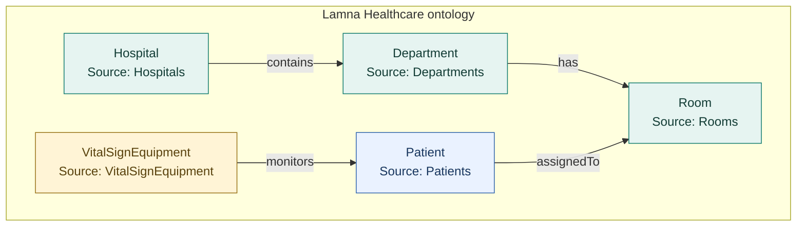

# FabricIQ mini Hands-on

A hands-on lab that combines **Fabric IQ (ontology)** and **Fabric data agents** for a class of **up to 25 participants** working in **one shared Fabric workspace**.

Everyone reads the **same shared** lakehouse (`LamnaHealthcareLH`) and eventhouse (`LamnaHealthcareEH`), but **each participant builds their own** ontology and data agent — tagged with their username so nothing collides.

It combines two Microsoft Learn labs:
1. [Create an ontology with Fabric IQ](https://microsoftlearning.github.io/mslearn-fabric/Instructions/Labs/23-build-ontology-manually.html)
2. [Build a Fabric data agent with an ontology](https://microsoftlearning.github.io/mslearn-fabric/Instructions/Labs/28-build-data-agent-ontology.html)

> **Preview notice:** Ontology in Microsoft Fabric is currently in [preview](https://learn.microsoft.com/fabric/fundamentals/preview).

---

## The three sessions

| Session | Who | What |
| --- | --- | --- |
| **1. Lab preparation** | Instructor | Provision the shared **lakehouse** `LamnaHealthcareLH` **and eventhouse** `LamnaHealthcareEH`; define the 25-participant roster and naming convention. → [session-1-lab-preparation.md](./sessions/session-1-lab-preparation.md) |
| **2. Create Ontology** | Each participant | Build your own `LamnaHealthcareOntology_<UserNN>` — entities, relationships, and static + time-series bindings. → [session-2-create-ontology.md](./sessions/session-2-create-ontology.md) |
| **3. Create Data Agent** | Each participant | Build your own `LamnaHealthcareAgent_<UserNN>`, ground it in your ontology, test, and publish. → [session-3-create-data-agent.md](./sessions/session-3-create-data-agent.md) |

---

## Naming convention

25 people share one workspace, so every item you create is suffixed with your **username** (`user01`–`user25`, written `User01` in item names).

| Item | Pattern | Example (user01) |
| --- | --- | --- |
| Ontology | `LamnaHealthcareOntology_<UserNN>` | `LamnaHealthcareOntology_User01` |
| Data agent | `LamnaHealthcareAgent_<UserNN>` | `LamnaHealthcareAgent_User01` |

**Shared items — never rename, edit, or delete:**

| Shared item | Type |
| --- | --- |
| `LamnaHealthcareLH` | Lakehouse (static data source) |
| `LamnaHealthcareEH` | Eventhouse (time-series data source) |

> Rule: a name **with** `_UserNN` belongs to a participant; a name **without** it is shared and read-only. The full roster is in [Session 1](./sessions/session-1-lab-preparation.md#12-participants-and-naming-convention).

---

## Repository structure

```
.
├── README.md                              # This overview
├── sessions/
│   ├── session-1-lab-preparation.md       # Instructor: shared lakehouse + eventhouse + roster
│   ├── session-2-create-ontology.md       # Participant: build your ontology
│   └── session-3-create-data-agent.md     # Participant: build your data agent
└── setup/
    └── setup-shared-lakehouse.ipynb       # Notebook run once in Session 1 (creates LH + EH)
```

---

## Prerequisites

- A **paid Fabric capacity** designated as a **Fabric Copilot capacity** (a Trial works for the ontology part but **not** for data agents).
- Tenant settings enabled by a Fabric Admin (Ontology preview + Graph preview + Copilot). Full list in [Session 1](./sessions/session-1-lab-preparation.md#required-tenant-settings).

---

## Quick start

1. **Instructor:** follow [Session 1](./sessions/session-1-lab-preparation.md) — create the shared **`FabricIQ-Handson-Shared`** workspace, run `setup/setup-shared-lakehouse.ipynb`, grant access, and hand out usernames.
2. **Participants:** work through [Session 2](./sessions/session-2-create-ontology.md) then [Session 3](./sessions/session-3-create-data-agent.md) using your assigned username.

---

## Ontology model



**Solid arrows** show the five directed ontology relationships. The **dashed arrow** shows the time-series data binding, not an additional relationship type.

All five entity types use static data from the shared **`LamnaHealthcareLH`** lakehouse. **`VitalSignEquipment`** also binds to **`VitalSignsReadings`** in **`LamnaHealthcareEH`**, matching readings by `EquipmentId` and using `Timestamp` for time-series data.

---

## Attribution

Adapted from the [MicrosoftLearning/mslearn-fabric](https://github.com/MicrosoftLearning/mslearn-fabric) hands-on labs (labs 23 and 27–28). The setup notebook provisions only the shared data sources, so each participant builds their own ontology and data agent. Reference screenshots in Sessions 2 and 3 are from those official Microsoft Learn labs.