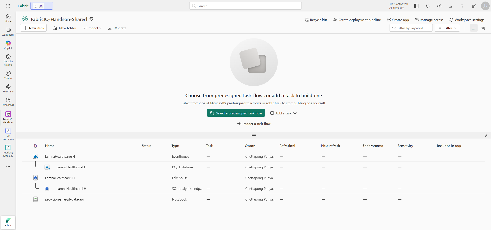
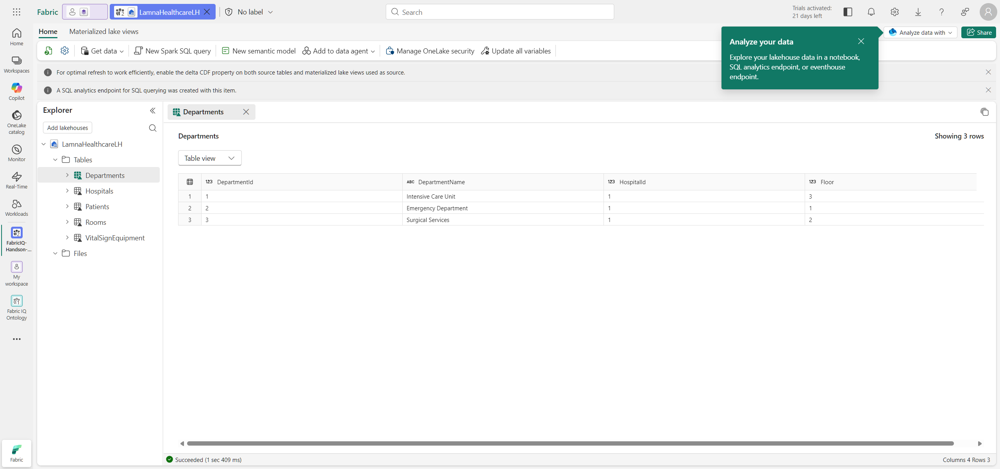

# Session 1 — Lab Preparation (Instructor)

This session is run **once by the instructor** before the class. It provisions the shared data and defines how 25 participants will share one workspace without stepping on each other.

Sessions in this lab:

1. **Session 1 — Lab preparation** *(this file)*
2. [Session 2 — Create Ontology](./session-2-create-ontology.md)
3. [Session 3 — Create Data Agent](./session-3-create-data-agent.md)

---

## Prerequisites

- A **paid Fabric capacity** (F SKU or Power BI Premium P SKU) designated as a **Fabric Copilot capacity**. A *Fabric Trial* works for the ontology part but **not** for data agents (Session 3 needs paid Copilot capacity).
- **Fabric Administrator** access to enable tenant settings.

### Required tenant settings

Enable in **Admin portal → Tenant settings** ([Ontology settings](https://learn.microsoft.com/fabric/iq/ontology/overview-tenant-settings) · [Data agent settings](https://learn.microsoft.com/fabric/data-science/data-agent-tenant-settings)):

Ontology (Fabric IQ):

- **Enable Ontology item (preview)**

Data agent (Copilot):

- **Users can use Copilot, AI Agents and other AI experiences powered by Azure OpenAI**
- **Capacities can be designated as Fabric Copilot capacities**
- **Data sent to Azure OpenAI can be processed outside your capacity's geographic region…** *(only if your capacity is outside the EU/US)*
- **Data sent to Azure OpenAI can be stored outside your capacity's geographic region…** *(only if your capacity is outside the EU/US)*

> Tenant setting changes can take up to one hour to apply. Current ontology documentation does not list a separate Graph tenant switch.

### Current instructor setup (2026-09-24)

Use the existing [FabricIQ-mini-Hands-on workspace](https://app.fabric.microsoft.com/groups/eacd516f-daa6-4084-a26a-af1acd5c3222/list?experience=fabric-developer) for this delivery. Do not create or rename a workspace to match the example name below. In Sessions 2 and 3, use this workspace wherever `FabricIQ-Handson-Shared` is mentioned.

| Check | Status |
| --- | --- |
| Fabric identity | `chettapongp@MngEnvMCAP702933.onmicrosoft.com`; workspace Admin verified |
| Capacity | `fabcapacitydemo`, active paid F8, West US 3; no capacity resize performed |
| Tenant settings | Ontology, Copilot/Azure OpenAI, and Copilot-capacity designation switches enabled; no tenant settings changed |
| Shared infrastructure | `LamnaHealthcareLH`, its SQL endpoint, `LamnaHealthcareEH`, and its KQL database created |
| Data loading | `provision-shared-data-api` completed successfully; all six row-count assertions passed |
| Participant access | `ttb_grp` granted Contributor with instructor approval; participant membership still required |
| Session 3 readiness | Confirm the capacity's actual Fabric Copilot designation and any capacity-level overrides before class |

F8 is below this guide's F16+ recommendation for 25 concurrent participants. Stagger starts or have the capacity administrator review sizing. The screenshots below show the earlier reference environment, not proof of this workspace's current state.

Verified counts: `Hospitals` 1, `Departments` 3, `Rooms` 10, `Patients` 5, `VitalSignEquipment` 5, and `VitalSignsReadings` 15. The completed job wrote its verification report to `LamnaHealthcareLH/Files/session1-validation.json`. All five Delta tables were also verified through the lakehouse Tables API.

The API-run notebook is `provision-shared-data-api` (`57cc62de-c0d3-4b6e-9987-fa7ae8c7eae4`); successful job ID: `37b42831-b69f-4943-8619-3c14d7a982f5`. It uses the repository's sample data cells with job-safe initialization instead of `%pip`, followed by explicit row-count assertions. The payload builder is [prepare-session1-job.ps1](../setup/prepare-session1-job.ps1); it only prepares a request file, and requires existing resource IDs. Re-running the data notebook overwrites the five lakehouse tables, so do not rerun it during participant work without coordination.

---

## 1.1 Provide the initial lakehouse and eventhouse

All 25 participants read from the **same shared** data sources. You create **both** once with the setup notebook:

- **`LamnaHealthcareLH`** — lakehouse holding the static hospital data (5 tables).
- **`LamnaHealthcareEH`** — eventhouse (KQL database) holding the time-series `VitalSignsReadings` used for the VitalSignEquipment time-series binding in Session 2.

Both are provisioned by the same notebook run — no separate steps are needed.

### Create the shared workspace

1. Go to the [Microsoft Fabric home page](https://app.fabric.microsoft.com/home?experience=fabric) and sign in.
2. Select **Workspaces** (🗇) → **New workspace**.
3. Name it **`FabricIQ-Handson-Shared`**.
4. Under **Advanced → License mode**, assign the **paid Fabric capacity** (not Trial).
5. Create the workspace.

### Run the setup notebook

1. In the workspace, select **Import → Notebook → From this computer**.
2. Upload [`setup/setup-shared-lakehouse.ipynb`](../setup/setup-shared-lakehouse.ipynb) from this repo.
3. Open the imported notebook.
4. On the first code cell (**Step 0**), select **Run this cell and all below** (or **Run all**).
5. Watch for the success messages:
   - Step 0 → `Infrastructure ready!` (creates **both** `LamnaHealthcareLH` and `LamnaHealthcareEH`)
   - Step 1 → `All lakehouse tables written!` (5 tables)
   - Step 2 → `Eventhouse step complete!` (creates the `VitalSignsReadings` table in `LamnaHealthcareEH`)

The notebook is **idempotent** — re-running reuses infrastructure, overwrites tables, and skips readings that already exist.

### What gets created

| Item | Type | Contents |
| --- | --- | --- |
| `LamnaHealthcareLH` | Lakehouse | `Hospitals`, `Departments`, `Rooms`, `Patients`, `VitalSignEquipment` |
| `LamnaHealthcareEH` | Eventhouse (KQL DB) | `VitalSignsReadings` (time-series, 15 rows) |

> The notebook **stops before creating any ontology** — participants build their own in Sessions 2 and 3.

### Verify both data sources

1. **Lakehouse** — open `LamnaHealthcareLH` → **Tables**: confirm all five tables (`Hospitals`, `Departments`, `Rooms`, `Patients`, `VitalSignEquipment`) have data.
2. **Eventhouse** — open `LamnaHealthcareEH` → its KQL database → confirm the `VitalSignsReadings` table appears, then run `VitalSignsReadings | count` → expect **15**.

> Both `LamnaHealthcareLH` and `LamnaHealthcareEH` should now be visible as items in the shared workspace.

*Figure: The shared workspace after provisioning — `LamnaHealthcareLH` (lakehouse + SQL endpoint) and `LamnaHealthcareEH` (eventhouse + KQL database).*

*Figure: `LamnaHealthcareLH` with the five tables (`Hospitals`, `Departments`, `Rooms`, `Patients`, `VitalSignEquipment`) populated with data.*

### Grant participants access

1. In the workspace, select **Manage access**.
2. Select **Add people or groups** and add the participant security group (for this delivery, `ttb_grp`) or all 25 participants.
3. Assign the **Contributor** role — the minimum that lets them create their own items *and* read the shared data. (Do **not** use Viewer.)

For this delivery, the group assignment is complete. Add the actual participant accounts or invited guests to `ttb_grp` using the designated Azure admin account, then test one participant's access. The roster below assigns lab suffixes; it does not create Microsoft Entra accounts or invite guests.

---

## 1.2 Participants and naming convention

Each participant is assigned a username `user01`–`user25`. Every item a participant creates is suffixed with their username in **PascalCase** (`User01`), so 25 ontologies and 25 data agents stay cleanly separated in one workspace.

### Naming convention

| Item | Pattern | Example (user01) |
| --- | --- | --- |
| Ontology | `LamnaHealthcareOntology_<UserNN>` | `LamnaHealthcareOntology_User01` |
| Data agent | `LamnaHealthcareAgent_<UserNN>` | `LamnaHealthcareAgent_User01` |

**Shared items — never rename, edit, or delete:**

| Shared item | Type |
| --- | --- |
| `LamnaHealthcareLH` | Lakehouse (data source) |
| `LamnaHealthcareEH` | Eventhouse (time-series data source) |

> Rule: a name **with** `_UserNN` belongs to a participant; a name **without** it is shared and must be treated as read-only. This is a lab convention, not an enforced permission boundary: Contributors can modify shared workspace items.

### Participant roster

| Participant | Username | Ontology name | Data agent name |
| --- | --- | --- | --- |
| Participant 1 | `user01` | `LamnaHealthcareOntology_User01` | `LamnaHealthcareAgent_User01` |
| Participant 2 | `user02` | `LamnaHealthcareOntology_User02` | `LamnaHealthcareAgent_User02` |
| Participant 3 | `user03` | `LamnaHealthcareOntology_User03` | `LamnaHealthcareAgent_User03` |
| Participant 4 | `user04` | `LamnaHealthcareOntology_User04` | `LamnaHealthcareAgent_User04` |
| Participant 5 | `user05` | `LamnaHealthcareOntology_User05` | `LamnaHealthcareAgent_User05` |
| Participant 6 | `user06` | `LamnaHealthcareOntology_User06` | `LamnaHealthcareAgent_User06` |
| Participant 7 | `user07` | `LamnaHealthcareOntology_User07` | `LamnaHealthcareAgent_User07` |
| Participant 8 | `user08` | `LamnaHealthcareOntology_User08` | `LamnaHealthcareAgent_User08` |
| Participant 9 | `user09` | `LamnaHealthcareOntology_User09` | `LamnaHealthcareAgent_User09` |
| Participant 10 | `user10` | `LamnaHealthcareOntology_User10` | `LamnaHealthcareAgent_User10` |
| Participant 11 | `user11` | `LamnaHealthcareOntology_User11` | `LamnaHealthcareAgent_User11` |
| Participant 12 | `user12` | `LamnaHealthcareOntology_User12` | `LamnaHealthcareAgent_User12` |
| Participant 13 | `user13` | `LamnaHealthcareOntology_User13` | `LamnaHealthcareAgent_User13` |
| Participant 14 | `user14` | `LamnaHealthcareOntology_User14` | `LamnaHealthcareAgent_User14` |
| Participant 15 | `user15` | `LamnaHealthcareOntology_User15` | `LamnaHealthcareAgent_User15` |
| Participant 16 | `user16` | `LamnaHealthcareOntology_User16` | `LamnaHealthcareAgent_User16` |
| Participant 17 | `user17` | `LamnaHealthcareOntology_User17` | `LamnaHealthcareAgent_User17` |
| Participant 18 | `user18` | `LamnaHealthcareOntology_User18` | `LamnaHealthcareAgent_User18` |
| Participant 19 | `user19` | `LamnaHealthcareOntology_User19` | `LamnaHealthcareAgent_User19` |
| Participant 20 | `user20` | `LamnaHealthcareOntology_User20` | `LamnaHealthcareAgent_User20` |
| Participant 21 | `user21` | `LamnaHealthcareOntology_User21` | `LamnaHealthcareAgent_User21` |
| Participant 22 | `user22` | `LamnaHealthcareOntology_User22` | `LamnaHealthcareAgent_User22` |
| Participant 23 | `user23` | `LamnaHealthcareOntology_User23` | `LamnaHealthcareAgent_User23` |
| Participant 24 | `user24` | `LamnaHealthcareOntology_User24` | `LamnaHealthcareAgent_User24` |
| Participant 25 | `user25` | `LamnaHealthcareOntology_User25` | `LamnaHealthcareAgent_User25` |

> Hand each participant their username and point them to [Session 2](./session-2-create-ontology.md).

---

## Capacity & housekeeping notes

- **25 ontologies** each spawn a background **Graph** item and processing. Expect heavy capacity load when many build at once — **F16+** is recommended for a class of 25. Consider staggering starts.
- Participant bindings read the shared data, but Contributor permissions also allow changes to shared items. Participants must not edit or delete those items.
- **Do not** delete `LamnaHealthcareLH` or `LamnaHealthcareEH` until everyone has finished.
- **Cleanup:** retain both lab environments and their artifacts per the instructor's instruction. Do not delete a workspace or shared item without separate explicit approval.

## Troubleshooting

| Symptom | Fix |
| --- | --- |
| Notebook Step 0 fails creating the eventhouse | Re-run the cell; eventhouse init is occasionally slow. |
| Participant can't create an Ontology item | Confirm the Ontology preview tenant setting applies to the user and the user has **Contributor**. |
| Data agent option missing / Copilot errors | Confirm **paid** capacity designated as **Fabric Copilot capacity** (Trial won't work). |
| Time-series charts empty | Set the ontology preview time filter to **Last 3 days** — readings use today's date. |
