# Session 2 — Create Ontology

In this session you build your **own** Fabric IQ ontology for *Lamna Healthcare*, bound to the **shared** data your instructor prepared in [Session 1](./session-1-lab-preparation.md).

Sessions in this lab:

1. [Session 1 — Lab preparation](./session-1-lab-preparation.md)
2. **Session 2 — Create Ontology** *(this file)*
3. [Session 3 — Create Data Agent](./session-3-create-data-agent.md)

> **Preview notice:** Ontology in Microsoft Fabric is currently in [preview](https://learn.microsoft.com/fabric/fundamentals/preview). · Estimated time: ~50 minutes.

> **About the screenshots:** Figures marked *live capture* show the September 24, 2026 run of `LamnaHealthcareOntology_User99` in the `FabricIQ-mini-Hands-on` workspace. Use that workspace wherever these instructions mention `FabricIQ-Handson-Shared`. Reference figures are from the official Microsoft Learn lab [Create an ontology with Fabric IQ](https://microsoftlearning.github.io/mslearn-fabric/Instructions/Labs/23-build-ontology-manually.html). UI labels may vary; use your assigned `_User<NN>` suffix. All screenshot files used here are stored in `sessions/images`.

---

## Your naming convention

Replace `<UserNN>` with **your assigned username** (e.g. `user99` → `User99`).

| You create | Name to use | Example (user99) |
| --- | --- | --- |
| Ontology | `LamnaHealthcareOntology_<UserNN>` | `LamnaHealthcareOntology_User99` |

**Shared — read only, never rename/delete:** `LamnaHealthcareLH` (lakehouse), `LamnaHealthcareEH` (eventhouse).

---

## Before you start

- Your instructor completed Session 1, so `LamnaHealthcareLH` and `LamnaHealthcareEH` already exist with data.
- You have **Contributor** access to the shared **`FabricIQ-Handson-Shared`** workspace and know your username.

---

## 2.0 Explore the shared data

1. Open the **`FabricIQ-Handson-Shared`** workspace from **Workspaces** (🗇).
2. Open `LamnaHealthcareLH` → **Explorer → Tables** and confirm: `Hospitals`, `Departments`, `Rooms`, `Patients`, `VitalSignEquipment`.
3. Open `LamnaHealthcareEH` → its KQL database and confirm the `VitalSignsReadings` table.

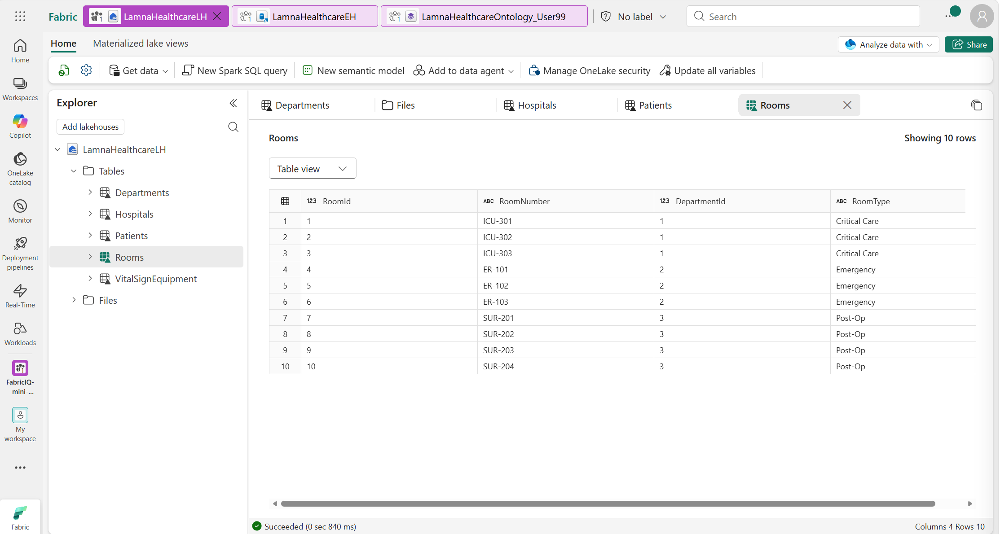
*Figure (live capture): The shared lakehouse tables and the ten rows in `Rooms`.*

You'll model this structure:

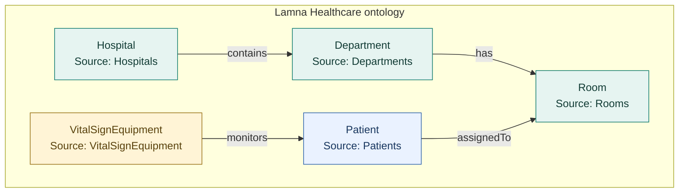

---

## 2.1 Create the ontology item

1. In the **`FabricIQ-Handson-Shared`** workspace, select **+ New item**.
2. Search for and select **Ontology (preview)**.
3. Name it **`LamnaHealthcareOntology_<UserNN>`** (e.g. `LamnaHealthcareOntology_User99`) and select **Create**.
4. The empty ontology canvas opens.

> Double-check the name includes **your** username before continuing.

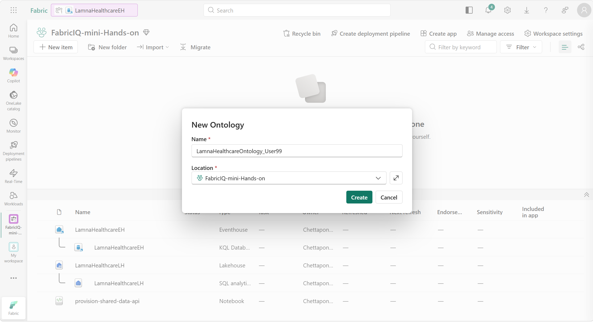
*Figure (live capture): Creating the User99 ontology in the current lab workspace.*

---

## 2.2 Create entity types

You'll create five entity types. Follow the detailed steps for **Hospital**, then use the reference table for the other four.

### Create the Hospital entity type

1. In the ontology ribbon, select **Add entity type**.
2. Enter `Hospital` and select **Add Entity Type**.
3. Select the **Hospital** entity type on the canvas, then select **View entity type details**.
4. In **Properties**, expand **Manage property bindings** and select **Add properties**.
5. Add each property, selecting **+ Add** after each:

   | Property | Type |
   | --- | --- |
   | HospitalId | Integer |
   | HospitalName | String |
   | City | String |
   | State | String |

6. Select **Save**.
7. Select **Define entity type key**, choose **HospitalId**, and select **Save**.
8. Select **Home** to return to the canvas.

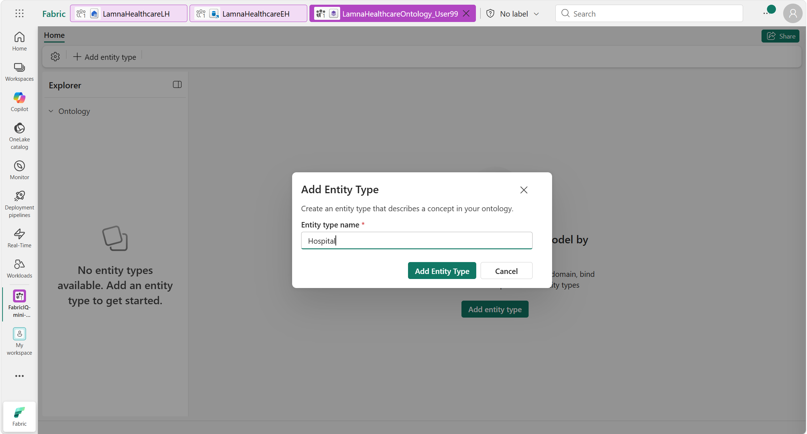
*Figure (live capture): Adding the first entity type, `Hospital`.*

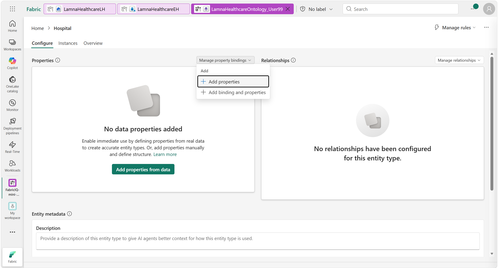
*Figure (live capture): Opening **Manage property bindings → Add properties** (step 4).*

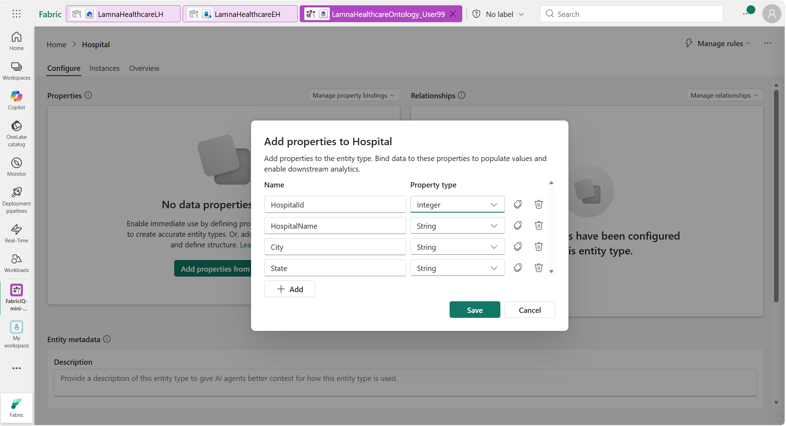
*Figure (live capture): Hospital's four properties and their types before saving (steps 5–6).*

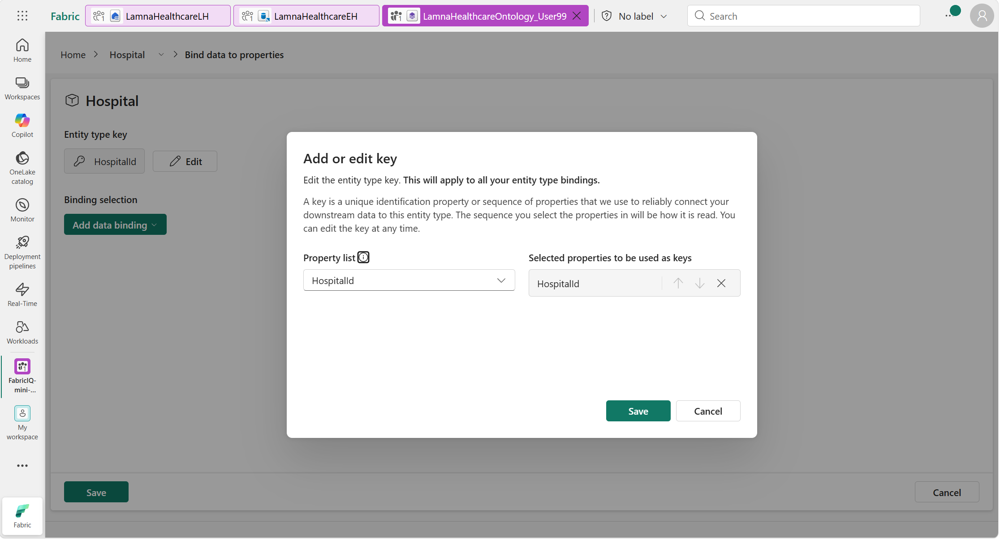
*Figure (live capture): Selecting `HospitalId` as the entity type key (step 7).*

### Create the remaining four entity types

Repeat the process (add properties, then define the key) for each:

| Entity type | Properties (name : type) | Key |
| --- | --- | --- |
| **Department** | DepartmentId : Integer DepartmentName : String HospitalId : Integer Floor : Integer | DepartmentId |
| **Room** | RoomId : Integer RoomNumber : String DepartmentId : Integer RoomType : String | RoomId |
| **Patient** | PatientId : Integer FirstName : String LastName : String DateOfBirth : DateTime AdmissionDate : DateTime CurrentRoomId : Integer | PatientId |
| **VitalSignEquipment** | EquipmentId : String PatientId : Integer EquipmentType : String MonitoringStartDate : DateTime | EquipmentId |

✅ You should now have **five** entity types, each with properties and a key.

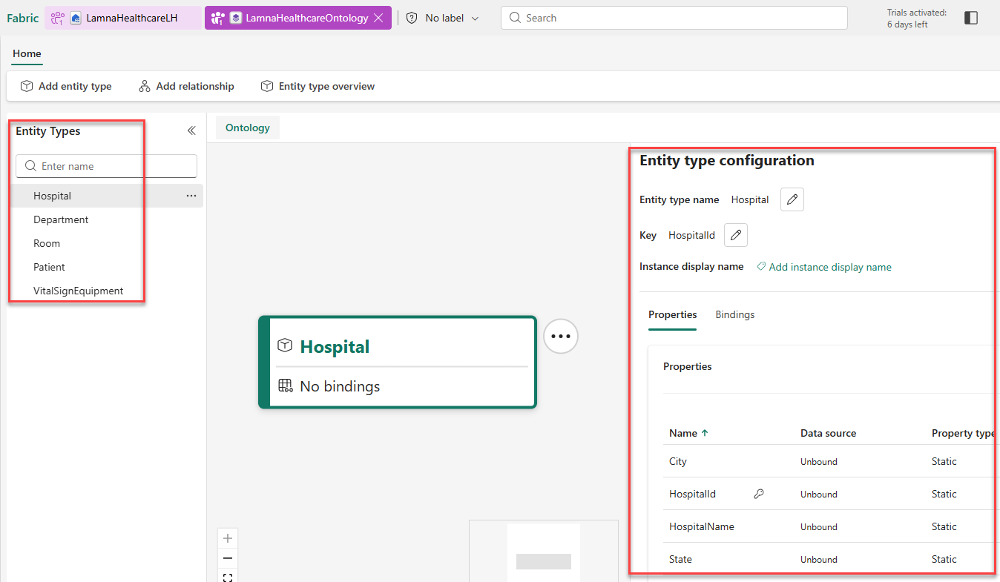
*Figure (reference): All five entity types created, with the Hospital entity type's properties and key.*

---

## 2.3 Create relationship types

Follow the detailed steps for the first relationship, then use the table.

### Create the Hospital → Department relationship

1. In the ribbon, select **Add relationship**.
2. Configure:
   - **Relationship type name:** `contains`
   - **Origin entity type:** `Hospital`
   - **Target entity type:** `Department`
3. Select **Create**. A `contains` line connects Hospital to Department.

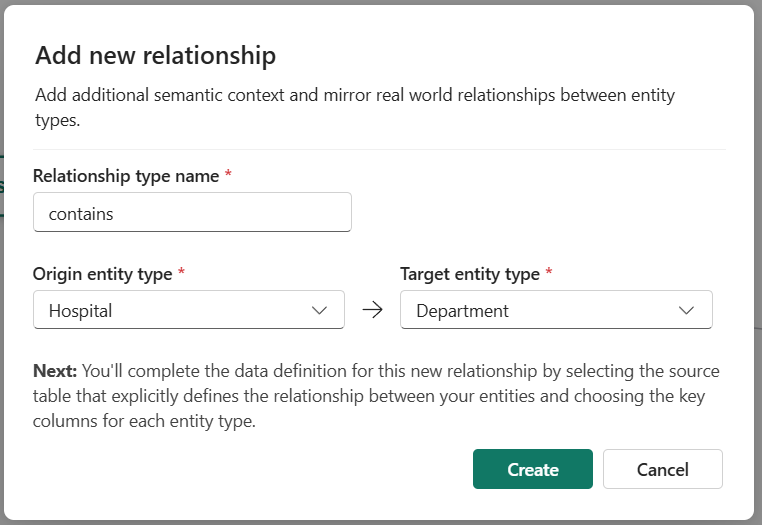
*Figure (reference): Adding the `contains` relationship from Hospital to Department.*

*Figure (live capture): The saved `contains` relationship from Hospital to Department.*

### Create the remaining three relationships

| Relationship name | Origin | Target | Meaning |
| --- | --- | --- | --- |
| `has` | Department | Room | Departments have rooms |
| `assignedTo` | Patient | Room | Patients are assigned to rooms |
| `monitors` | VitalSignEquipment | Patient | Equipment monitors patients |

✅ Your canvas now shows five entity types connected by four relationships.

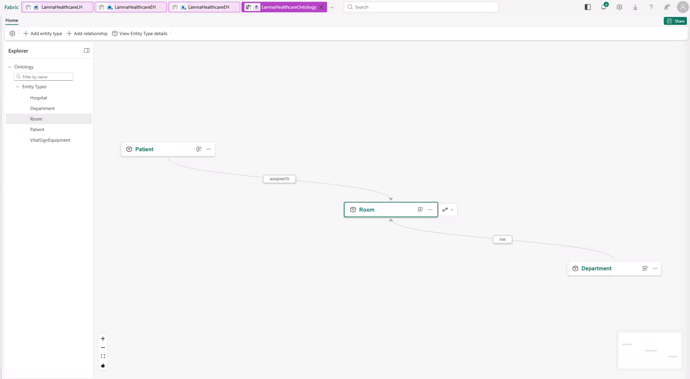
*Figure (reference): The `assignedTo` and `has` relationships connecting Patient and Department to Room.*

---

## 2.4 Bind entity types to data

The schema is a template until you bind it to the **shared** lakehouse and eventhouse.

### Bind the Hospital entity

1. Select **Hospital**, select the ellipsis (**…**) next to its name, and select **Bind data**.
2. Select **Add data binding → Lakehouse table**.
3. Select **`LamnaHealthcareLH`** (shared) → **Next**.
4. Select the **`Hospitals`** table → **Select**.
5. Keep **Binding type = Static**.
6. Confirm the auto-mapping (names match):
   - Key: `HospitalId → HospitalId`
   - `HospitalName → HospitalName`, `City → City`, `State → State`
7. Select **Save**, confirm success, then **Cancel** → **Home**.

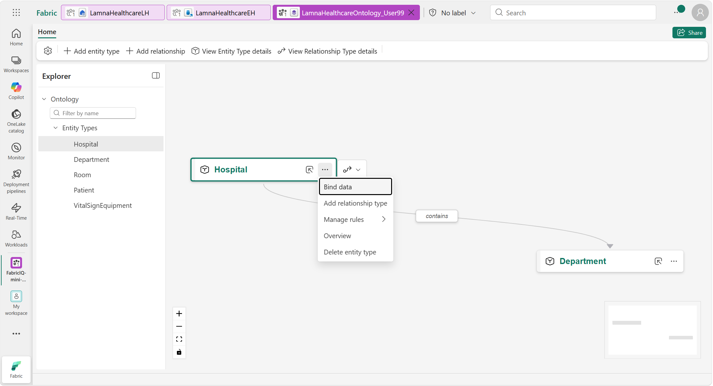
*Figure (live capture): Opening Hospital's **Bind data** command (step 1).*

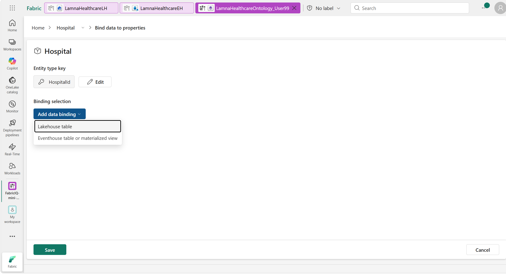
*Figure (live capture): Choosing a lakehouse table as the static source (step 2).*

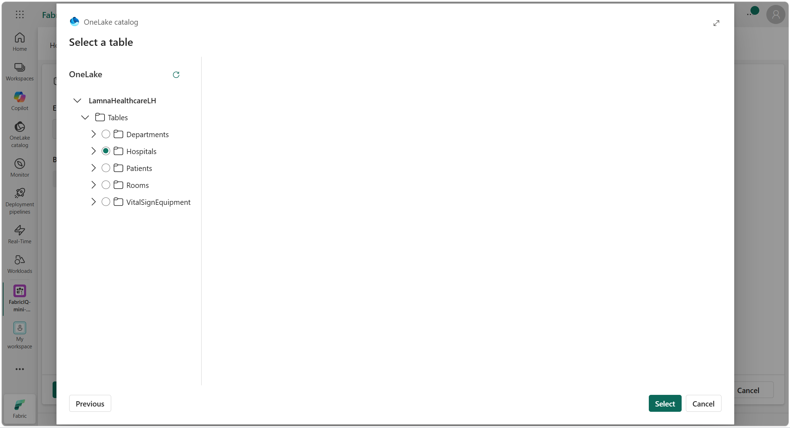
*Figure (live capture): Selecting the shared `Hospitals` table (steps 3–4).*

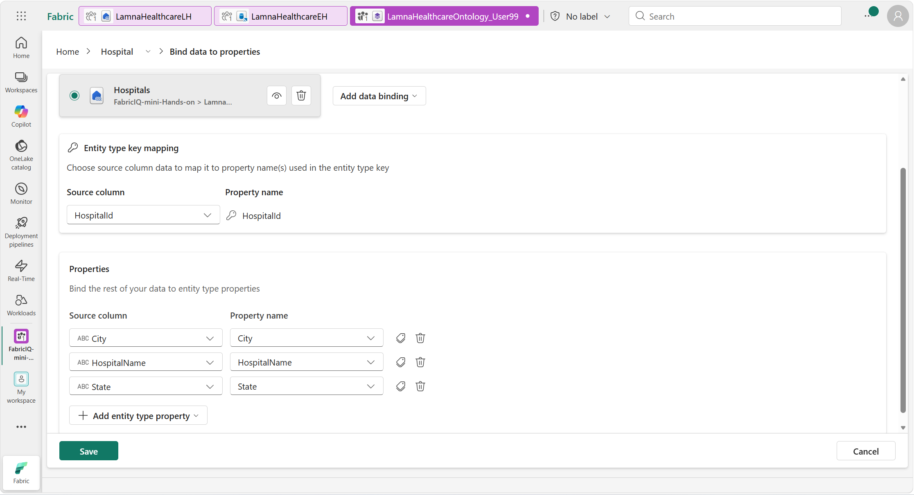
*Figure (live capture): Checking the key and property mappings before saving (steps 6–7).*

### Bind Department, Room, and Patient (static only)

Repeat the binding process against the **shared `LamnaHealthcareLH`** for each:

| Entity | Lakehouse table | Properties (auto-map) |
| --- | --- | --- |
| Department | `Departments` | DepartmentId, DepartmentName, HospitalId, Floor |
| Room | `Rooms` | RoomId, RoomNumber, DepartmentId, RoomType |
| Patient | `Patients` | PatientId, FirstName, LastName, DateOfBirth, AdmissionDate, CurrentRoomId |

### Bind VitalSignEquipment (static + time-series)

This entity needs **two** bindings. Do the static one first — the time-series binding depends on it.

**Static reference data (lakehouse):**

1. Select **VitalSignEquipment** → **…** → **Bind data**.
2. Select **Add data binding → Lakehouse table**.
3. Select **`LamnaHealthcareLH`** → **Next**.
4. Select the **`VitalSignEquipment`** table → **Select**.
5. Keep **Static**.
6. Confirm the auto-mapping:
   - `EquipmentId → EquipmentId`
   - `PatientId → PatientId`
   - `EquipmentType → EquipmentType`
   - `MonitoringStartDate → MonitoringStartDate`
7. Select **Save**, confirm success.

**Time-series vital signs data (eventhouse):**

1. With VitalSignEquipment still open (or **…** → **Bind data** again), select **Add data binding → Eventhouse table**.
2. Select **`LamnaHealthcareEH`** (shared eventhouse) → **Next**.
3. Select the **`VitalSignsReadings`** table → **Add**.
4. Under **Timeseries data**, select **`Timestamp`** as the timestamp column.
5. Confirm the key mapping — `EquipmentId` should be auto-selected under **Entity type key mapping** (it links readings to your equipment entities).
6. Map the time-series properties (auto-map; if not, select **Add entity type property → Add all source columns as properties**):
   - `ReadingId → ReadingId`
   - `Timestamp → Timestamp`
   - `HeartRate → HeartRate`
   - `OxygenSaturation → OxygenSaturation`
   - `RespiratoryRate → RespiratoryRate`
7. Select **Save**, confirm success, then **Home**.

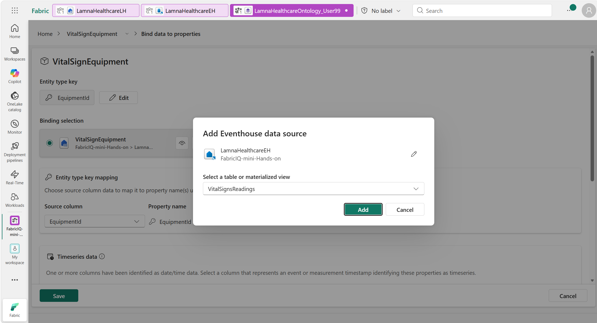
*Figure (live capture): Adding `VitalSignsReadings` from the shared eventhouse after the static equipment binding (steps 1–3).*

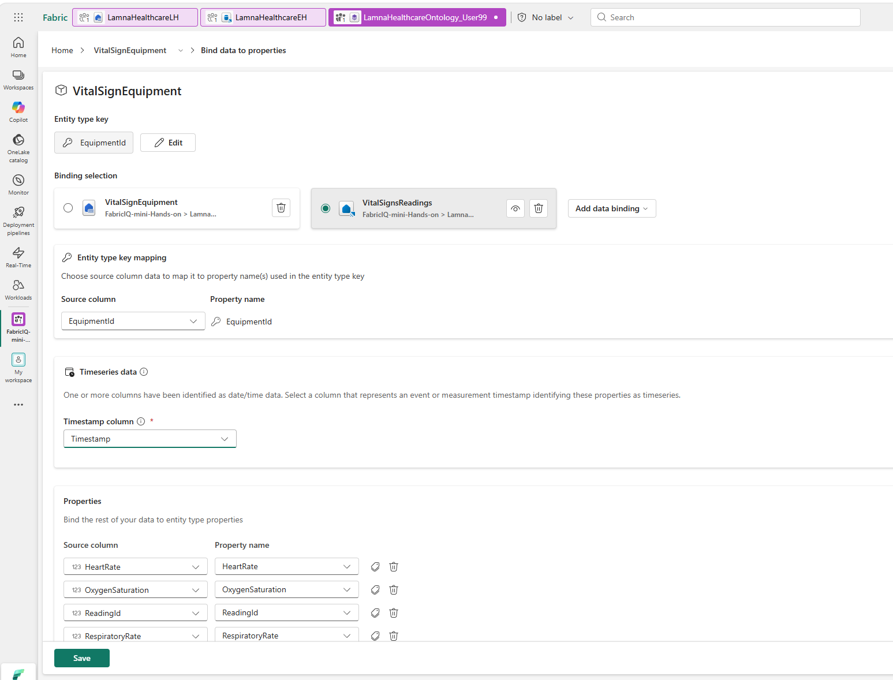
*Figure (live capture): Configuring the time-series timestamp, equipment key, and measurement mappings before saving (steps 4–7).*

> **Why two bindings?** The lakehouse table gives each monitor its context (which patient, what type). The eventhouse table streams the measurements, attached to those monitors by `EquipmentId`.

✅ All five entity types now have data bindings.

---

## 2.5 Configure relationships

Tell each relationship which table links the instances. Do the first, then use the table.

### Configure the contains (Hospital → Department) relationship

1. On the canvas, select the **Hospital** entity, then select **contains** on the line to Department.
2. Configure the mappings:
   - **Origin (Hospital):** select **HospitalId**
   - **Target (Department):** select **DepartmentId**
3. Select **Save**, confirm success, then **Cancel** → **Home**.

### Configure the remaining three relationships

For each: select the relationship line, set the source table (in the shared `LamnaHealthcareLH`) and the two column mappings, then **Save**.

| Relationship | Source table | Origin match | Target match |
| --- | --- | --- | --- |
| `has` (Department → Room) | `Rooms` | Department: DepartmentId | Room: RoomId |
| `assignedTo` (Patient → Room) | `Patients` | Patient: PatientId | Room: CurrentRoomId |
| `monitors` (VitalSignEquipment → Patient) | `VitalSignEquipment` | VitalSignEquipment: EquipmentId | Patient: PatientId |

✅ All relationships now have source data.

---

## 2.6 Add descriptions and metadata (semantic enrichment)

Entity types, properties, and relationships can carry **descriptions** and **metadata** that document your business vocabulary — what each concept means, alternative names, units, and sensitivity. This makes the ontology self-describing for people, governance, and downstream tools.

> **Good to know:** In the current preview, the **data agent does not consume these enrichment fields** — you tune agent behavior with **Agent instructions** in Session 3. Enrichment is still valuable for human readability, discoverability, governance, and other Fabric IQ experiences, so it's a best practice to add it.

Three enrichment types are available:

| Object | Description | Synonyms | Additional metadata (key–value) |
| --- | --- | --- | --- |
| Entity type | ✔ | ✔ | ✔ |
| Property | ✔ | — | ✔ |
| Relationship type | ✔ | — | ✔ |

### Enrich an entity type

1. In the **Explorer** pane, select the **Hospital** entity type, then select **View entity type details** in the ribbon.
2. In the **Metadata** section, select **Edit**.
3. Add a **Description**, e.g. `A healthcare facility in the Lamna Healthcare network.`
4. Add **Synonyms** (comma-separated), e.g. `Facility, Medical Center`.
5. (Optional) Add **Additional metadata** key–value pairs, e.g. `Business owner: Operations`, `Sensitivity: Internal`.
6. Select **Update**.

Repeat for the other four entity types (suggested values — adjust as you like):

| Entity type | Description | Synonyms | Example metadata |
| --- | --- | --- | --- |
| Department | A clinical unit within a hospital (ICU, Emergency, Surgical Services). | Unit, Ward | `Domain: Clinical operations` |
| Room | A patient room within a department. | Bed, Ward room | `Domain: Clinical operations` |
| Patient | A person currently admitted to the hospital. | Admission | `Sensitivity: Confidential` |
| VitalSignEquipment | A monitoring device assigned to a patient that streams vital sign readings. | Monitor, Vital sign monitor | `Domain: Medical devices` |

### Enrich a property

1. On the **Configure** page of an entity type, open its **data binding configuration** (expand **Manage property bindings**).
2. In the **Properties** section, select the **Tag** icon next to the property you want to enrich.
3. Add a **Description** and, for numeric measures, an **Additional metadata** unit.
4. Select **Update**.

Suggested property enrichment:

| Entity type → Property | Description | Example metadata |
| --- | --- | --- |
| Room → RoomType | Category of room, such as Critical Care, Emergency, or Post-Op. | — |
| Patient → DateOfBirth | The patient's date of birth. | `Sensitivity: Confidential` |
| VitalSignEquipment → HeartRate | Heart rate measurement from the monitor. | `unit: bpm` |
| VitalSignEquipment → OxygenSaturation | Blood oxygen saturation measurement. | `unit: %` |
| VitalSignEquipment → RespiratoryRate | Breathing rate measurement. | `unit: breaths/min` |

### Enrich a relationship type

1. On the canvas, select a relationship line (e.g. **contains**), then open its configuration.
2. In the **Metadata** section, select **Edit**.
3. Add a **Description** and, optionally, **Additional metadata**.
4. Select **Update**.

Suggested relationship descriptions:

| Relationship | Description |
| --- | --- |
| contains | A hospital contains departments. |
| has | A department has rooms. |
| assignedTo | A patient is assigned to a room. |
| monitors | Vital sign equipment monitors a patient. |

> **Tip — writing good descriptions:** start with what the object represents, add business context, keep it to one to three sentences, and use consistent key names for metadata across your ontology.

✅ Your ontology is now documented with descriptions and metadata.

---

## 2.7 Preview your ontology

1. Select **Room** from the **Entity Types** list.
2. In the ribbon, select **Entity type overview**.
3. You'll see *"Updating your ontology"* while Fabric processes the bindings. This can take **2–20 minutes** (heavier with 25 people building at once). Refresh the browser periodically.
4. Once ready, you'll see the relationship graph, property charts, and an entity instances table.
5. Select any room instance (e.g. `ICU-302`) to view its properties and connections.

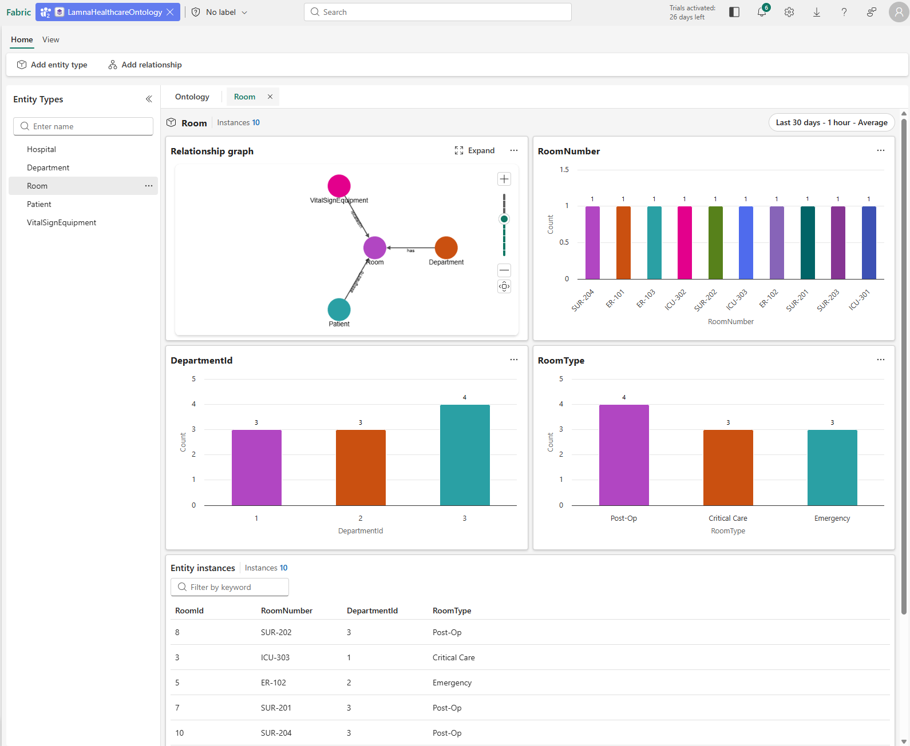
*Figure (reference): The entity type overview once background processing completes.*

> **Tip:** For the VitalSignEquipment time-series charts, set the time-range filter (top-right) to **Last 3 days** — readings use today's date.

🎉 You've built a complete ontology grounded in shared healthcare data.

**Next:** [Session 3 — Create Data Agent](./session-3-create-data-agent.md) puts a natural-language agent on top of your ontology.
