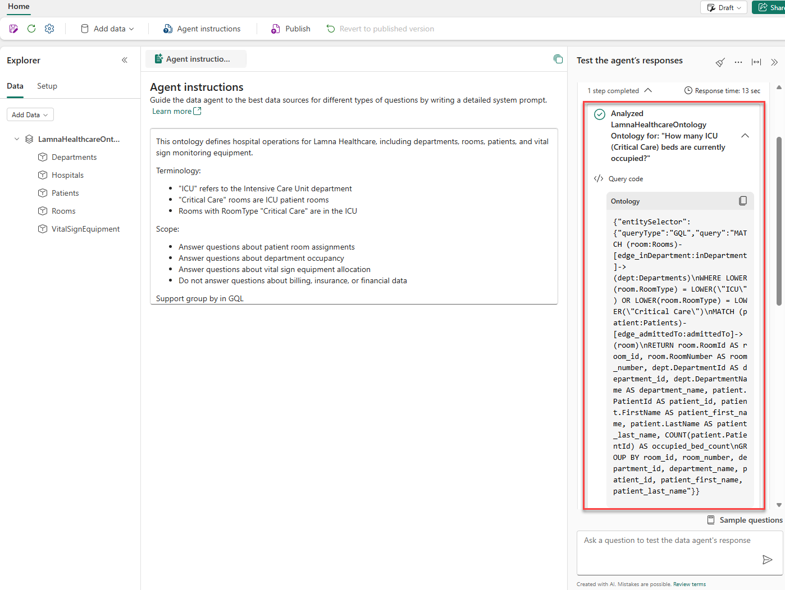

# Session 3 — Create Data Agent

In this session you create your **own** Fabric data agent and ground it in the ontology you built in [Session 2](./session-2-create-ontology.md), so it can answer natural-language questions like *"How many ICU beds are occupied right now?"*.

Sessions in this lab:

1. [Session 1 — Lab preparation](./session-1-lab-preparation.md)
2. [Session 2 — Create Ontology](./session-2-create-ontology.md)
3. **Session 3 — Create Data Agent** *(this file)*

> Estimated time: ~30 minutes. Requires **paid Fabric Copilot capacity** (a Trial does not support data agents).

> **About the screenshots:** The figure below is the reference screenshot from the official Microsoft Learn lab [Build a Fabric data agent with an ontology](https://microsoftlearning.github.io/mslearn-fabric/Instructions/Labs/28-build-data-agent-ontology.html) that this session is based on.

---

## Your naming convention

Replace `<UserNN>` with **your assigned username** (e.g. `user07` → `User07`).

| You create | Name to use | Example (user07) |
| --- | --- | --- |
| Data agent | `LamnaHealthcareAgent_<UserNN>` | `LamnaHealthcareAgent_User07` |

You connect it to **your own** ontology from Session 2: `LamnaHealthcareOntology_<UserNN>`.

---

## Before you start

- You completed Session 2 and your `LamnaHealthcareOntology_<UserNN>` shows entity instances in **Entity type overview** (wait for background processing to finish).
- You're in the shared **`FabricIQ-Handson-Shared`** workspace with **Contributor** access.

---

## 3.1 Create the data agent

1. In the **`FabricIQ-Handson-Shared`** workspace, select **+ New item**.
2. Search for `data agent` and select **Data agent**.
3. Name it **`LamnaHealthcareAgent_<UserNN>`** (e.g. `LamnaHealthcareAgent_User07`) and select **Create**.
4. The agent opens with an **Explorer** pane on the left and a **chat** pane on the right.

> Confirm the name includes **your** username.

---

## 3.2 Add your ontology as a data source

1. Select **Add a data source**.
2. In the search box, type **`LamnaHealthcareOntology_<UserNN>`** — be sure to pick **your own** ontology, not another participant's.
3. Select it and select **Add**.
4. In the **Explorer** pane, verify all five entity types appear: Hospital, Department, Room, Patient, VitalSignEquipment.

---

## 3.3 Configure agent instructions

For ontology data sources, instructions are the **only** tuning mechanism (example queries aren't supported).

1. In the toolbar, select **Agent instructions**.
2. Paste the following:

   ```
   This ontology defines hospital operations for Lamna Healthcare, including departments, rooms, patients, and vital sign monitoring equipment.

   Terminology:
   - "ICU" refers to the Intensive Care Unit department
   - "Critical Care" rooms are ICU patient rooms
   - Rooms with RoomType "Critical Care" are in the ICU

   Scope:
   - Answer questions about patient room assignments
   - Answer questions about department occupancy
   - Answer questions about vital sign equipment allocation
   - Do not answer questions about billing, insurance, or financial data

   Support group by in GQL
   ```

3. Close the instructions pane.

---

## 3.4 Test with natural-language questions

Ask each question in the chat pane. After each answer, expand the **steps** dropdown to see the entity types/relationships used and the generated **GQL** query.


*Figure: Expanding the steps under an answer reveals the GQL the agent generated.*

1. `How many ICU beds are occupied right now?`
   - Expect the agent to filter Room by the ICU Department and check occupancy.
2. `How many patients are currently admitted?`
   - Expect a total patient count across departments.
3. `Which patient is in room ICU-301?`
   - Expect the agent to traverse from Room to Patient (the `assignedTo` relationship).
4. `How many rooms in the Surgical Services department are currently occupied?`
   - Expect a count of rooms by department.
5. `Which vital sign equipment is in the Emergency department?`
   - The agent may return **no results** — that's expected. Explore further:
   - `Where is the vital sign equipment located?`
   - Review which departments actually have equipment. *(Start broad, then refine — a key data-agent skill.)*
6. `Which department has the most patients now?`
   - Expect a ranked result (tests aggregation).

> **Tip:** When the agent misreads a term, return to **Agent instructions** and add a clarifying definition — that's how you tune behavior over time.

---

## 3.5 Publish your data agent

1. In the toolbar, select **Publish**.
2. In **Description of purpose and capabilities**, enter:

   ```
   Queries the Lamna Healthcare ontology to answer questions about patient room assignments, department occupancy, and vital sign equipment allocation.
   ```

3. Leave **Also publish to the Agent Store in Microsoft 365 Copilot** set to **Off** for this lab.
4. Select **Publish**.
5. In the toolbar, select the **Draft** button and switch to **Published** to see the version colleagues would use.

> Publishing creates two versions: a **Draft** you keep editing, and a stable **Published** version others can query.

---

## Cleanup

**Do not delete the shared items** (`LamnaHealthcareLH`, `LamnaHealthcareEH`) — other participants and your own agent depend on them.

To remove **only your** items, delete `LamnaHealthcareAgent_<UserNN>`, `LamnaHealthcareOntology_<UserNN>`, and the auto-created **Graph** item for your ontology. Otherwise your instructor removes the whole workspace after the session.

---

## Summary

Across the three sessions you:

- **Session 1** — used a shared healthcare **lakehouse** (`LamnaHealthcareLH`) and **eventhouse** (`LamnaHealthcareEH`) prepared for the class.
- **Session 2** — built **your own** Fabric IQ ontology: entity types, keys, relationships, and static + time-series data bindings.
- **Session 3** — created **your own** Fabric data agent, connected it to your ontology, tuned it with instructions, tested natural-language questions, and published it.

The ontology's business vocabulary — entity types, properties, and relationships — is what lets the data agent answer plain-language questions over operational data.
